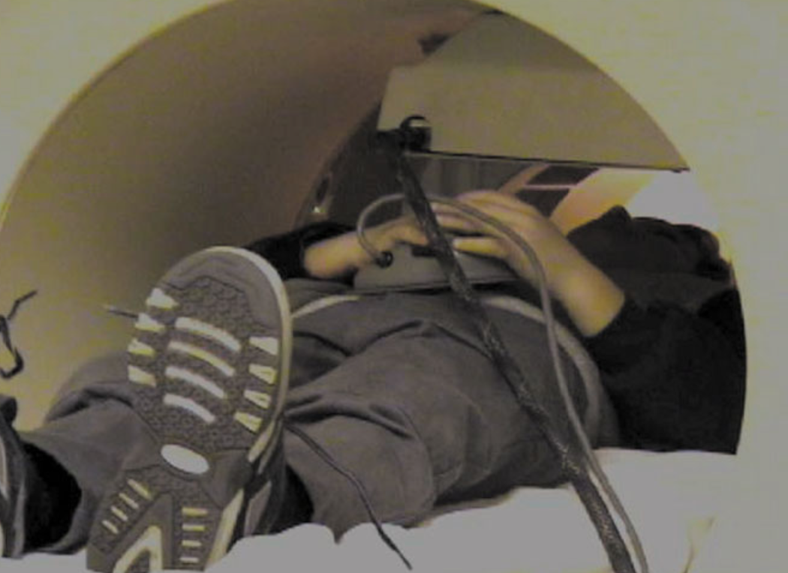
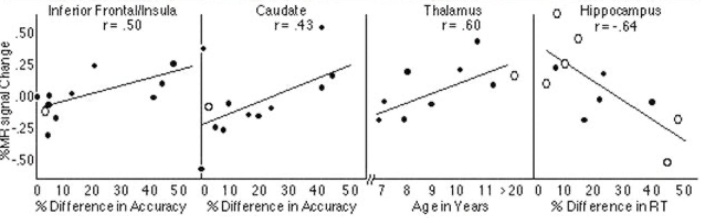

Davidson, M. C., Thomas, K. M., & Casey, B. J. (2003). Imaging the developing brain with fMRI. Mental Retardation and Developmental Disabilities Research Reviews, 9(3), 161–167. [https://doi.org/10.1002/mrdd.10076](https://doi.org/10.1002/mrdd.10076)

# Figure 1

## Simulation

Q. What is the purpose of the presimulator tunnel?

A. According to the figure's description, the presimulator tunnel is used for initial acclimation and test of anxiety with young children. This play tunnel is equal in diameter to the opening of the scanner, so it mimicks being in the real thing. The researchers will not move on to the next phase of the study until the child appears comfortable.

## Hardware

Q. What is device the child hoding in his/her hands? What is the purpose of the device?

A. The figure's description says "He is making responses with a device identical to the pad used in the actual scanner." So technically what he's holding is not a real pad used in an actual scanner, but a simulator device. The purpose of the device is to allow the participant to give input during scanner-related tasks (e.g. "push the button for each of the characters, except for Meowth").

# Figure 2

## Perspective

Q. From which perspective are we viewing the brain (i.e., top, bottom, left, right front, or back)?

A. I believe from the back of the head looking forward. The paper doesn't actually say which perspective we're viewing from, but the R and L in the image suggest it's either front or back. I found this [informal forum](https://forums.studentdoctor.net/threads/why-are-mri-images-reversed.1305344/) that says left on an MRI is the patient's right and vice versa, which would make this from the back.

## Spatial Relationships

Q. There are three images of brains. How are they spatially related?

A. I believe we're looking at the same brain but at different cross sections, and I think the cross sections are moving from the back of the head toward the front.

## Alternate Universe

Q. The figure higlight the brain regions showing a robust MR signal change for __the interaction of group (children, adults) by condition (incompatible, compatible)__. Suppose in the alternate universe, the authors did not discover any signifiant interaction, what would the figure look like instead?

A. There would be no highlighted regions?

## Variation 1

Suppose we were to plot a figure to instead show only interaction between groups (children vs. adults). Would we see more or fewer highlighted regions? Why?

A. I think fewer highlighted regions, because while children performed worse in the incompatible condition (corresponding to more highlighted regions) than adults, the study was supposed to be designed such that children and adults exert equal effort; meaning their scans would looks more similar and I think that corresponds to less highlighting. 

## Variation 2

Q. Suppose we were to plot a figure to instead show interaction between groups (children vs. adults) by conditions (imcompatible, compatible) and __by income level__. Would we see more or fewer highlighted regions? Why?

A. Well I'd expect that income level doesn't directly correlate with any changes in the brain that an MRI could detect. But if we plotted with that bunk data anyway, my guess is that there would be more highlighted regions because I think it gets more highlighted the more differences there are (and adults' income level would certainly be higher than the childrens').

# Figure 3

## Anatomy

Q. In the first brain image, what is the dark circle at the center bottom?

A. I think that's the spinal cord.

## Spatial Ordering

Q. What is the spatial ordering among the four images (e.g., top-down, left-right...etc)?

A. Back-to-front

## Changes

Q. Why were MR signal changes reported as a percentage rather than an absolute term?

A. Because they were doing a correlation analysis, not a direct measurement. Or, if I misunderstood that question, it could be because the MR signal comes from changes in blood flow that increase the level of oxygenated hemoglobin (and reduce deoxygenated hemoglobin), and this blood flow change is represented as a percentage.

## Baseline

Q. What were the percentage changes relative to?

A. Differences in accuracy, age in years, and RT? Or this question might be looking for "levels of oxygenated/deoxygenated hemoglobin".

## Wishful Thinking

Q. Suppose we wish that the correlation can be even stronger for the inferior cortex. What would want the first plot to look different (i.e., the value of r, the patterns of dots)?

A. We'd want the first plot to contain dots that are closer to the line of best fit.

## Flipped Diretion

Q. The paper reports that "Similar comparisons between accuracy performance and intensity of activation revealed positive correlations in the caudate nucleus and inferior frontal cortex, __with more activation__ in these regions for subjects making a greater number of errors. (last sentence on p. 165)" Support this finding were flipped, how would the figure look differently?

A. The figure would look differently in that when number of errors was high, there would be less activation and we would see less highlighting.

